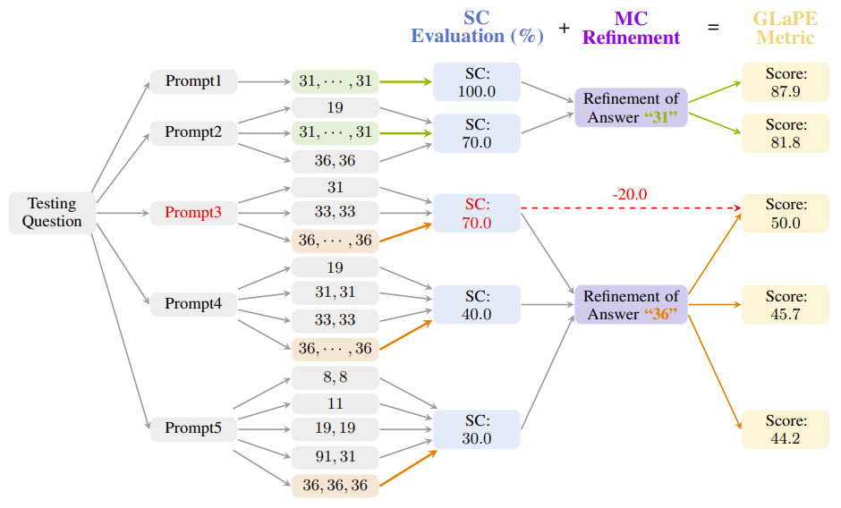

# GLaPE: Gold Label-agnostic Prompt Evaluation and Optimization for Large Language Models

Supercharge your prompt optimization without the hassle of elusive gold labels!

Introducing GLaPE (Gold Label-agnostic Prompt Evaluation) – a groundbreaking methodology leveraging self-consistency and mutual-consistency refinement.

Our GLaPE-based prompt optimization yields prompts comparable to accuracy-based ones.

<div align="left">

</div>

## Requirements
Make sure you have Python>=3.8 installed on your machine.
```
pip install torch==1.8.2+cu111 torchtext==0.9.2 -f https://download.pytorch.org/whl/lts/1.8/torch_lts.html
pip install -r requirements.txt
```

## Quick Start

> Set your OpenAI API key first

GLaPE-based prompt optimization (Ours):

```
python main.py --dataset=gsm8k \
--test_dataset_size=50
```

Accuracy-based prompt optimization ([OPRO](https://arxiv.org/abs/2309.03409)):

```
python main.py --dataset=gsm8k \
--test_dataset_size=50
--evaluation_metric=accuracy	
```

## Key arguments

```
--eval_dataset_size # The size of dataset to evaluate the prompt. To save budget, set it smaller.
--test_dataset_size # The size of dataset to test the optimal prompt. Default 0, which means use the whole dataset.
--cot_generate_times * --cot_generate_num # The total number of new prompts generated in the optimization trajectory.
```

## Citation
